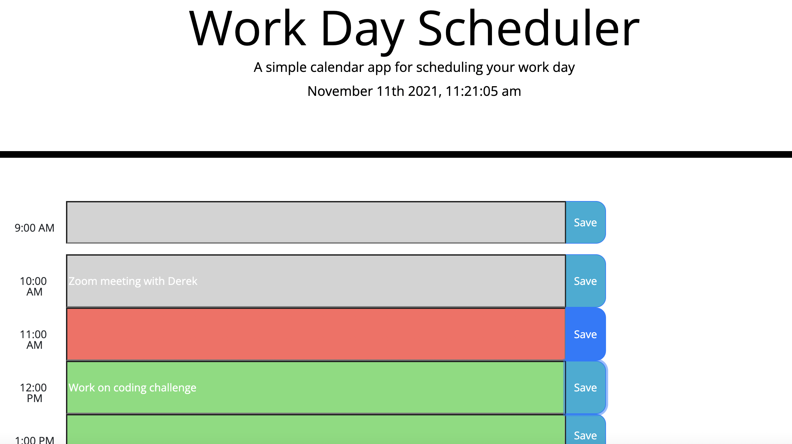

## work-day-scheduler 

* [License](#license)

## License
This project is licensed under the N/A license.
## Description 
A schedule for your work day that you can add events to. The time slots change color depending on if a time is in the past present or future. If a scheduled event is in the past it is grey, present is colored red and future times are colored green. The color codes help to improve productivity.',
      

*[Usage](#usage)

*[Installation](#installation)

*[Instructions](#instructions)

*[License](#license)

*[Contributors](#contributors)

*[Contact](#contact)

## Visual 

## Usage 
  usage: 'As an emloyee I want to plan my work day and complete tasks according to time urgency.'
# Installation
false
## Instructions
To use this project ssimply navigate  to the website URL.
## License
N/A
## Contributors 
Bridget Schaefer

# Contact
* GitHub :bridgetvon
* E-mail :bridget.schaefer31@gmail.com